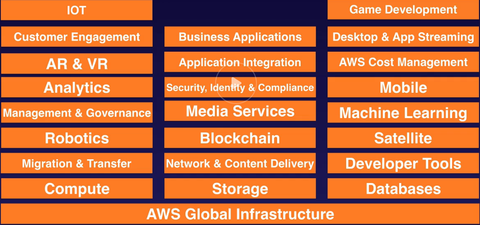

# What I Cloud Computing

More information in: [Overview if amazon web services](https://docs.aws.amazon.com/whitepapers/latest/aws-overview/types-of-cloud-computing.html)

## What is cloud computing

Cloud computing is the on-demand delivery of compute, database, storage, applications, and other IT resources through a cloud services platform via the internet with pay-as-you-go pricing.

Think of it as simply renting someone elses computer

## The 6 Advantages Of Cloud Computing

### 1. Trade Capital Expense for Variable Expense
Instead of having to invest heavily in data centers and server before you know how you're going to use them, you can pay only when you consume computing resources, and pay only for how much you consume. (This is discussed on the whitepapers)

### 2. Benefit from massive economies of scale
You will never have the purchasing power as Amazon. They literally build their own servers

### 3. Stop guessing about capacity
You will probably either buy too much or too little. If you buy too much, you've wasted money and if you buy too little you will have down time. Cloud can scale with your business needs, with no long term contracts.

### 4. Increase speed and agility
The A cloud Guru platform was built in 3 weeks, using a new type of design called serverless architecture. It scales infinitely with demand. 15 years ago we shold have had to buy servers and rent data center space and we probably never would have got off the ground

### 5. Stop spending money runnin and maintaining data centers
Focus on what you are good at, not at managing infrastructure. Let someone elses manage that for you.

### 6. Go global in minutes.
Easily deploy your application in multiple regions around the world with just a few clicks. This means you can provide lower latency and a better experience for your customers at minimal cost.

## Cloud computing types

### Infrastructure As A Services (IAAS)
You manage the server which can be physical or virtual, as well as the operating system. Usually the data centre provider will have no access to your server.

### Platform As A Services (PAAS)
Someone elses manages the underlying hardware and operating systems. You just focus on your applications. Someone else worries about security patching, updates, maintenance, etc.

### Software As A Services (SAAS)
Think of Gmail. All you manage is your inbox (or the software provided to you by Google). Google take care of the data centers, servers, networks, storage, maintenance, patching, etc. All you worry about is the software itself and how you want yo use it.

## Types of cloud computing deployments

### Public cloud - AWS, Azure, GCP
### Hybrid - Mixtre of the public and private
### Private cloud (or On Premise) - You manage it, in you datacenter. Openstack or Vmware

## AWS - High level services
